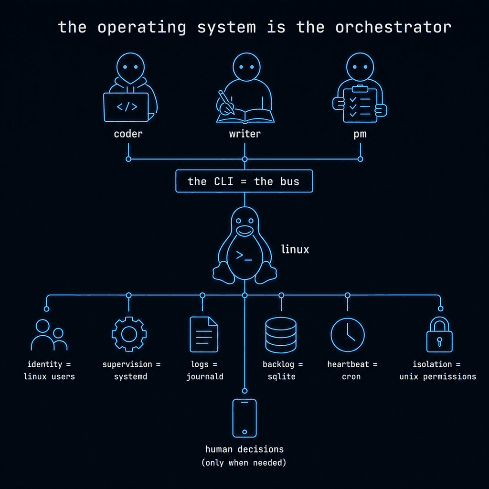

<p align="center">
  <a href="https://5dive.ai?utm_source=github&utm_medium=owned&utm_campaign=5dive-readme">
    <picture>
      <source media="(prefers-color-scheme: dark)" srcset="docs/readme-hero-dark.png">
      
    </picture>
  </a>
</p>

<p align="center"><b>run a company of AI agents on a server you own</b></p>

<p align="center"><b>English</b> ｜ <a href="README.zh-CN.md">简体中文</a></p>

<p align="center">
  <a href="docs/zero-human.md"></a>
  <a href="https://github.com/5dive-ai/5dive/releases"></a>
  <a href="LICENSE"></a>
</p>

<p align="center">
  <a href="https://github.com/5dive-ai/5dive/actions/workflows/install-smoke.yml"></a>
  <a href="https://github.com/5dive-ai/5dive/actions/workflows/bundle-drift.yml"></a>
  <a href="https://t.me/ai5dive"></a>
  <a href="https://discord.gg/aU2UQC9Myy"></a>
</p>

<p align="center">
  <a href="#quickstart">Quickstart</a> ·
  <a href="#why-5dive">Why 5dive</a> ·
  <a href="#things-to-try">Things to try</a> ·
  <a href="docs/zero-human.md">Zero-human proof</a> ·
  <a href="#for-your-ai-agent">Use from your AI agent</a> ·
  <a href="#security--isolation">Security</a> ·
  <a href="https://5dive.ai/docs/5dive-cli?utm_source=github&utm_medium=owned&utm_campaign=5dive-readme">Full CLI docs</a> ·
  <a href="https://5dive.ai?utm_source=github&utm_medium=owned&utm_campaign=5dive-readme">Managed VM</a>
</p>

**A company of AI agents, and the orchestrator is just bash.** No framework, no protocol, no broker: each agent is its own Linux user running an official coding CLI (claude, codex, a few others) as a systemd service, coordinating through one bash CLI they all call. Isolation is unix users, supervision is systemd, logs are journald. **I used the OS instead of building a platform.**

Run one persistent agent, or grow it into a team. They take work off a shared SQLite task queue, talk to each other, hand work off while you sleep, and you decide the rest on your phone. Works with every major agent CLI.


> **We run our own company on this.** The agents that build 5dive.ai cut this repo's releases. We keep the calls on spend, publishing and anything destructive. The badge up top is that claim, measured: releases shipped versus decisions escalated to a human. Same binary you're installing. MIT, no open-core. Run it yourself, or skip the ops with the [managed VM](https://5dive.ai?utm_source=github&utm_medium=owned&utm_campaign=5dive-readme).

**Run your whole company in plain language**, from the AI agent you already have. Add the [`5dive-cli` skill](#for-your-ai-agent): create agents, assign work, read the org chart. [One-line setup ↓](#for-your-ai-agent)

---

## Quickstart

```sh
# 1. install
curl -fsSL https://install.5dive.ai | sudo bash

# 2. create your first agent, the wizard wires Telegram too:
#    paste a bot token (BotFather gives you one), send the bot /start,
#    and it pairs itself. No codes.
sudo 5dive init
```

Scripting it instead (CI, provisioning)? The non-interactive path needs one
extra step, the bot replies to your first DM with a pairing code:

```sh
sudo 5dive agent create my-agent --type=claude --channels=telegram --telegram-token=<token>
sudo 5dive agent pair   my-agent --code=<pairing-code>
```


**Requirements:** a Linux box with `systemd` and your own agent-CLI subscription or API key (Claude Pro/Max, OpenAI, …), no account with us.

> **“`curl | sudo bash`, and agents with `sudo`?”** Fair question. The installer only apt-installs deps and drops the CLI + systemd units (every file it fetches is listed at the top of [`install.sh`](install.sh)). Each agent is then its own Linux user, and you choose its blast radius, a `sandboxed` agent gets its own home, no sudo, and resource limits. Details: [Security & isolation ↓](#security--isolation).

---

## Why 5dive

**They escalate, you decide.** Agents work autonomously, and the calls you reserved come to your phone as tap-to-answer buttons: spend, publishing, anything destructive.

**A company that runs itself.** Named agents on one host, reporting up an org chart, handing each other work off a shared backlog.

**A subscription that's yours.** Official CLIs on your own Pro/Max or keys. No middleman, no OAuth proxy.

**Runs as a service, not a session.** Agents stay alive when you close the terminal. Message them from Telegram any time.

**Runs on tiny boxes.** 5dive adds no heavy runtime around your coding CLI: just Bash, SQLite, and systemd. A single-agent setup can comfortably run on a 1 GB VM.

**Every major agent CLI.** `claude`, `codex`, `antigravity`, `grok`, `openclaw`, `hermes`, `opencode`, `pi`, all under one team.

**Safe by default.** Each agent is its own Linux user under one of three isolation tiers. MIT, no open-core split.

---

## How it works

Each agent is its own Linux user running an official agentic AI CLI session (`claude`, `codex`, `antigravity`, `grok`, …) as a systemd service. Multiple agents can share the same CLI binary and subscription. Agents reach each other by invoking the same `5dive` CLI, that *is* the bus. Channels like Telegram attach per agent.

<p align="center">
  
</p>

No broker, no protocol, no framework. Shared filesystem, shared CLI.

---

## Agent types

| Type | Model family | Auth | Channels |
|------|-------------|------|----------|
| `claude`      | Anthropic Claude, or any Anthropic-compatible endpoint | OAuth / API key / `--provider` | Telegram, Discord |
| `codex`       | OpenAI Codex           | OAuth / API key | Telegram |
| `antigravity` | Google Antigravity     | Google OAuth | Telegram |
| `grok`        | xAI Grok               | OAuth (xAI) / API key | Telegram |
| `devin`       | Cognition Devin        | OAuth (Devin account) | — |
| `hermes`      | third-party multi-provider harness | API key | Telegram, Discord |
| `openclaw`    | third-party multi-provider harness | API key | Telegram, Discord |
| `opencode`    | OpenCode               | API key | Telegram |
| `pi`          | third-party multi-provider harness | API key / `--provider` | Telegram |

<details>
<summary><b>About <code>hermes</code> / <code>openclaw</code> (third-party multi-provider harnesses)</b></summary>

`hermes` and `openclaw` are community-built harnesses that can route to many providers (OpenRouter, Anthropic, Google, Moonshot, DeepSeek, Z.ai, etc.). As of April 4, 2026, Anthropic no longer permits routing consumer Claude Pro/Max OAuth through third-party harnesses. For that work, use the official `claude` type with your own API key. Background: [We Ditched OpenClaw for Claude →](https://blog.5dive.ai/blog/we-ditched-openclaw-for-claude/?utm_source=github&utm_medium=owned&utm_campaign=5dive-readme).

</details>

The `claude` type can also run the official Claude Code harness against a third-party Anthropic-compatible endpoint, bring your own key:

```sh
sudo 5dive agent create cheap-coder --type=claude --provider=deepseek --api-key=<key> --auth-profile=deepseek
# providers: openrouter (any model), deepseek (DeepSeek), moonshot (Kimi), qwen (Alibaba Qwen), zai (GLM)
# claude BYO requires --auth-profile=<name> (the account the key is saved under; reuse it to share the key across agents)

# Already have the agent? You do NOT need to recreate it — point it at another account:
sudo 5dive agent create kimi --type=claude --provider=moonshot --api-key=<key> --auth-profile=kimi
sudo 5dive agent set-account cheap-coder kimi        # rebinds + restarts the agent; "default" clears
# (`5dive account set-active-provider` is a DIFFERENT thing and is type=hermes only — it flips the
#  active provider inside one hermes profile, and refuses on claude. For claude, switch the ACCOUNT.)

# Pick the model too. --model overrides the primary tiers with any slug the
# provider serves (OpenRouter translates every family); the background model
# stays on the provider's cheap default. Omit it to use the per-provider default.
sudo 5dive agent create glm-coder --type=claude --provider=openrouter --api-key=<key> --auth-profile=openrouter --model=z-ai/glm-5.2
```

Prefer to save the key once and hand it to agents by name? `account set` configures the account with no agent involved; every later `agent create --auth-profile=<name>` or `agent set-account` reuses it (more under [Accounts](#accounts-shared-auth-profiles)):

```sh
sudo 5dive account add or-alpha
printf '%s' "$OPENROUTER_API_KEY" | sudo 5dive account set or-alpha --type=claude --provider=openrouter --api-key=-
sudo 5dive agent create scout --type=claude --auth-profile=or-alpha
```

Not on that list? `--base-url` points the harness at **any** Anthropic-compatible
endpoint — a model you host yourself, or a vendor host we don't ship a row for:

```sh
# Open weights on a server you own. --model is required here: there is no catalog
# entry to inherit per-tier model ids from, and an unpinned background tier would
# 404 on the agent's own housekeeping turns.
sudo 5dive agent create mistral-box --type=claude \
  --base-url=https://llm.internal.example.com/anthropic \
  --api-key=<key> --auth-profile=mistral-box --model=mistral-large-3

# A local inference server (vLLM, llama.cpp, an Ollama Anthropic shim):
sudo 5dive agent create local-box --type=claude \
  --base-url=http://127.0.0.1:8000 \
  --api-key=<key> --auth-profile=local-box --model=<slug>
```

`https://` is required — the API key rides that URL on every request. `http://` is
accepted only for `localhost` / `127.0.0.1` / `[::1]`, where the traffic never leaves
the box; a private-LAN address is still a real network and is refused. `--base-url`
requires `--auth-profile`, like every claude BYO path, so the endpoint and its key
are scoped to the agents you bind to that profile rather than to every claude agent
on the host. In a `5dive compose` spec the key is `base_url`.

Switch the model on a running agent (persists across restarts):

```sh
sudo 5dive agent config glm-coder set model=z-ai/glm-5.2
```

In-session, Claude Code's built-in `/model <slug>` also accepts any custom slug live (session-scoped).

---

## Things to try

`5dive company`<br>
Stand up a self-steering company in one command.

`5dive task`<br>
Manage the shared task queue and every agent-to-agent handoff.

`5dive goal add "Ship billing v2"`<br>
Turn an outcome into a guarded task graph.

`5dive loop spawn --role=researcher --agent=scout --prompt="Track competitor launches"`<br>
Run bounded autonomous work in a persistent agent loop.

`sudo 5dive plugin add 5dive-ai/5dive-council`<br>
Add the Council. It is an opt-in plugin; the constitution (`5dive constitution`) and the human-gate floor it seals work without it.

`sudo 5dive council init --seats=alice:chair,bob,carol --threshold=majority --veto=human:you`<br>
Seed the Council's genesis roster. A human does this once; the primary Council refuses to convene until it exists.

`5dive council convene "Should we ship?" --mode=adversarial`<br>
Convene an auditable adversarial review with multiple agents.

`5dive trace DIVE-42`<br>
Inspect a task's complete causal timeline from origin to verdict.

`5dive run ls --status=abandoned --since=24h`<br>
Every attempt has a receipt. A run is one agent's one attempt at one task — who ran, why they woke, what happened, what it cost where that is actually measurable, and how it recovered. `5dive run metrics` turns those into success rate, first-attempt success, verifier rejection rate and human touches. `trace` still tells the story; runs are the unit beneath it.

`5dive watch`<br>
Watch the whole team in real time.

`sudo 5dive plugin add 5dive-ai/5dive-ui`<br>
Then `5dive ui` opens local browser views for the org chart, task queue, human gates, and signed trigger deliveries. The UI is a plugin with [its own repo](https://github.com/5dive-ai/5dive-ui).

`5dive wall main olivia dev quinn ops --grid=3x2`<br>
Those five seats' live terminals tiled on one screen, read-only; plain `5dive wall` tiles every running seat. `C-b w` makes one pane writable, `C-b d` detaches.

`5dive project add mobile --prefix=MOB --lead-agent=dev`<br>
Run several products off one team. Each project numbers its own tasks (MOB-1, MOB-2) and has its own lead.

`5dive project set-status mobile complete`<br>
Move a lane through its life: `active`, `complete`, `archived`, `binned`, `backlogged`. Anything but `active` or `backlogged` stamps `archived_at`, and only an `active` project takes new tasks.

`5dive org tree`<br>
Who reports to whom. Gates route up this chart, and `sudo 5dive human add you --telegram=<chat id>` names the person whose phone they reach.

`sudo 5dive plugin add 5dive-ai/5dive-browser`<br>
Install a plugin straight from a GitHub repo. This one gives the whole team a shared, human-authenticated browser.

`5dive fleet status`<br>
Reachability and agent counts across every box you registered with `5dive fleet add`.

`5dive digest --7d`<br>
The last seven days of the team's work on one page. `5dive digest on` delivers it to your Telegram every day.

`5dive trigger`<br>
Turn signed GitHub or generic webhook events into ordinary tasks.

`5dive memory search "release checklist"`<br>
Search the team's durable memory with provenance.

`5dive acp`<br>
Connect Zed, Buzz, and other clients over ACP.

---

## For your AI agent

If you already use Claude Code / Codex / Antigravity / Grok / opencode, paste this prompt. Your agent installs 5dive, learns the skill, then keeps managing agents through chat:

```
Install 5dive on this Linux host so I can use you to manage 5dive agents.

1. Run the installer (idempotent, safe to rerun):
   curl -fsSL https://install.5dive.ai | sudo bash
2. Confirm: `5dive --version` prints a version string (e.g. "5dive 0.5.x").
3. Install the 5dive-cli skill. Replace <runtime> with one of
   claude-code, codex, antigravity, grok, hermes-agent, openclaw, opencode:
   npx -y skills add https://github.com/5dive-ai/skills --skill 5dive-cli --agent <runtime> --yes
4. Tell me to restart so the skill loads, then ask which agent to create first.
```

**Installing onto a remote VM over SSH?** Same prompt, prefix the install line with `ssh -t <user@host>`. Install the skill on the laptop where you're issuing `ssh` from, not the remote. Use `ssh -t` for anything needing a TTY (e.g. `5dive agent auth login`).

---

## Security &amp; isolation

Each agent is one Linux user. Three tiers are available at create time, and a fourth is conferred afterwards:

| Tier | What the seat can actually run as root |
|------|--------|
| `sandboxed` | nothing — no sudo at all. Own home, systemd resource limits |
| `standard` (default) | a handful of named `5dive` subcommands, nothing else |
| `admin` | **the whole `5dive` CLI as root — not root on the box.** Auto-granted to the first agent on a fresh box |
| `beyond-admin` | any command, as any user. Conferred by an operator with `agent grant`, never at create time |

```sh
sudo 5dive agent create my-agent --type=claude --isolation=sandboxed
```

**`admin` is not root, and the difference bites.** An `admin` seat holds
`ALL=(root) NOPASSWD: /usr/local/bin/5dive, /usr/local/bin/5dive *` — every 5dive
subcommand, and nothing else. It cannot `systemctl restart`, edit a Caddyfile,
write a unit file or `sudo -u someone-else`. That is deliberate: `journalctl`,
`systemctl status` and a writable `/etc/systemd/system` are each a one-line root
escape, so granting them would make `admin` mean root while still reading as a
middle tier. Host remediation is reached through hardened verbs instead —
`5dive host unit|journal|cron` — which need no sudoers change at all.

When a seat genuinely needs the whole box, say so rather than hand-editing a
sudoers drop-in:

```sh
sudo 5dive agent grant my-agent root      # writes a managed, visudo-checked
                                          # ALL=(ALL) NOPASSWD: ALL, stamps the
                                          # label beyond-admin, records an audit row
```

`5dive agent info <name>` then reports the **measured** grant beside the stored
label and warns when the two disagree — so a seat's privilege is something you
read, not something you infer from a tier name.

**No middlemen.** 5dive runs on your server. Auth tokens go to model providers directly, never to us. No telemetry, no error reporting, no usage data leaves the box. Long form: [your auth tokens don't touch us →](https://blog.5dive.ai/blog/your-auth-tokens-dont-touch-us/?utm_source=github&utm_medium=owned&utm_campaign=5dive-readme).

---

<details>
<summary><b>More team ops: accounts, a shared bot, commands, characters</b></summary>

### Clone a working company

Don't assemble a team agent by agent. Import a whole org in one call:

```sh
sudo 5dive team import solo-founder
# spins up the agents, their roles, the org chart, and seeds their starting backlog
```

Browse templates with `5dive team ls`, or define your own in a `5dive.yaml` and
`5dive up`. A template is a company you can fork: engineering pod, research desk,
content engine, support crew. Clone it, point it at your keys and bots, done.

### Give them work

Agents on a box share a task queue (sqlite, no server). File work, assign it, and let the heartbeat wake the assignee only when there's something to do. Recurring templates materialize on a cron schedule:

```sh
5dive task add "triage overnight CI failures" --assignee=ops --recurring="0 7 * * *"
sudo 5dive heartbeat on ops --every=30m
```

When an agent hits something only a human can decide, it parks the task on you:

```sh
5dive task need DIVE-42 --type=approval --ask="Ship pricing v2?" --options="ship|hold" --recommend=ship
```

That arrives on your Telegram as tap-to-answer buttons. Tap one, and the owning agent is unblocked and resumes. `5dive task inbox` lists everything waiting on a human, and `5dive org` keeps a reporting chart so you can see who works for whom.

External systems can file the same ordinary rows through authenticated triggers:

```sh
openssl rand -hex 32 | sudo 5dive trigger add github \
  --name=github-issues --event=issues.labeled --repo=acme/app \
  --where='label.name == "5dive"' --role=engineering --secret-from-stdin
sudo 5dive trigger serve --listen=127.0.0.1:8740
```

Put HTTPS in front of the loopback receiver. It verifies HMAC before parsing,
deduplicates sender delivery IDs, applies backpressure, and stops at the task
queue rather than starting an agent directly. See [signed event triggers](docs/triggers.md).

### Accounts (shared auth profiles)

One sign-in, many agents:

```sh
sudo 5dive account add   work
sudo 5dive account login work --type=claude
sudo 5dive agent create agent-a --type=claude --auth-profile=work
sudo 5dive agent create agent-b --type=claude --auth-profile=work
```

`login` is the interactive OAuth flow. For a bring-your-own provider key, `account set` configures the profile directly — no agent required:

```sh
sudo 5dive account add or-alpha
printf '%s' "$OPENROUTER_API_KEY" | sudo 5dive account set or-alpha \
  --type=claude --provider=openrouter --api-key=- --model=stealth/union-alpha
sudo 5dive agent set-account coder or-alpha
```

Pass the key on stdin with `--api-key=-`: a literal `--api-key=<value>` works but is visible in `ps` while the call runs and lands in shell history. Replacing credentials a profile already carries needs `--replace`, and the replace is audited — the row names the profile and the provider, never the key.

Rename or rotate the account, every bound agent rebinds automatically. `5dive account usage` shows each account's rate-limit headroom.

### One bot for the whole team

Per-agent bots are optional. Point one shared bot at a Telegram group (topics enabled) and every agent gets its own forum topic:

```sh
sudo 5dive agent team-bot shared --group=<chat_id> --agents=coder,writer,pm --token=<bot-token>
```

New agents auto-attach with their own topic (opt out per agent with `--no-team-bot`). `team-bot discover` finds the group id for you, and `team-bot intercom` mirrors inter-agent chatter into a dedicated topic so you can watch the team coordinate.

### Import a character

A template gives you roles. A **character pack** gives you a personality, a ready-made persona with its own voice, model, effort, and bundled skills:

```sh
sudo 5dive agent marketplace ls            # browse the character-pack registry
sudo 5dive agent import olivia --as=ceo    # spin up a named agent from a pack
```

`--as` is the agent's name on your box; the pack supplies the persona, model, and skills. Add `--channels=telegram` to wire a bot at import time. Packs live in the [`5dive-ai/5dive-marketplace`](https://github.com/5dive-ai/5dive-marketplace) registry, and a `5dive.yaml` can reference one with `pack: <slug>`.

### Plugins

A plugin adds something to every seat on the box at once: a channel (Telegram, Discord), a verb (a new top-level `5dive <verb>`), or a capability such as a shared browser or voice. It is a directory with a Claude Code plugin manifest (`.claude-plugin/plugin.json`). 5dive installs it box-level and registers it with every existing agent and every agent created later: Claude Code seats through their own plugin install, other harnesses through the plugin's `AGENTS.md` section.

```sh
sudo 5dive plugin add 5dive-ai/5dive-browser       # from its own repository
sudo 5dive plugin add 5dive-ai/5dive-voice         # from any GitHub repo that carries a marketplace.json
sudo 5dive plugin list                             # version, tier, enabled, what it registers
sudo 5dive plugin upgrade browser@5dive-browser
sudo 5dive plugin disable browser@5dive-browser    # a flag flip; the code stays on disk
sudo 5dive plugin rollback browser@5dive-browser 1.1.0
```

`add` shows where the plugin comes from and exactly what it will be handed, then waits for you to agree: a plugin is code that runs with your agents' access. `5dive market --kind=plugin` is the catalog, and the same list is on the dashboard under **Plugins**.

**Official and community.** A plugin from [github.com/5dive-ai](https://github.com/5dive-ai) is `official`. A plugin from any other repository is `community`, whatever its own manifest says. Community plugins install from the command line after a consent screen that shows the repository and commit and says: *Not from 5dive. It runs with your agents' access; there is no sandbox.* The dashboard's one-click install takes official plugins only.

> **There is no remote kill switch.** Plugins are not signed yet and 5dive cannot revoke one, so if a community plugin turns out to be bad, the off switch is on your server: `sudo 5dive plugin disable <plugin>@<marketplace>` (or `remove`). Install community plugins from publishers you would trust with your agents' credentials.

**Develop your own.** Start from [5dive-plugin-template](https://github.com/5dive-ai/5dive-plugin-template), the smallest plugin that installs: one verb, one skill and one setting. Any repository that follows the [5dive plugin standard](docs/plugin-contract.md) installs with `sudo 5dive plugin add <owner>/<repo>`: a `.claude-plugin/marketplace.json` naming its plugins, and a `plugin.json` that carries a `fivedive` block. A plain Claude Code plugin with no `fivedive` block is refused. [5dive-browser](https://github.com/5dive-ai/5dive-browser) and [5dive-voice](https://github.com/5dive-ai/5dive-voice) are two we ship that way; [5dive-plugins](https://github.com/5dive-ai/5dive-plugins) is the marketplace with the rest (telegram, dashboard, buzz). A plugin declares what it registers (`channel`, `verb`, `skill`, `mcp`). A verb plugin ships `bin/<verb>` and is reached only after every builtin command, so it can never take `5dive task` from you; a manifest naming a builtin, or a verb another plugin already claims, is refused at install.

### See the org layer: `5dive ui`

The web UI is a plugin, in [its own repository](https://github.com/5dive-ai/5dive-ui). One install, no build step, no account:

```sh
sudo 5dive plugin add 5dive-ai/5dive-ui
5dive ui                 # http://127.0.0.1:8735
```

Four views over the box you are on:

- **Org chart** who reports to whom, what each agent is holding, and every live handoff on the board: who gave the work, who holds it, who grades it. The headline counts how many of those handoffs ran agent to agent with no human in the path.
- **Queue** every open row with its assignee, its verifier, and where a maker-to-verifier handoff has got to.
- **Gates** what is parked on a person, at which tier, with the asking agent's recommended answer.
- **Triggers** configured GitHub/generic rules plus delivery outcomes and links from accepted deliveries to their tasks.

It is read-only and binds to loopback (there is no sign-in, so `--host` refuses a routable address unless you set `FIVE_UI_ALLOW_REMOTE=1`). Anything that changes state has a CLI verb. `5dive ui --data` prints the same JSON the views render, so you can pipe it somewhere else — and `5dive board --json`, a builtin, is where that JSON comes from: core owns the [board document](docs/board-contract.md), the plugin owns the presentation.

Four views is a start, not a finish — the [5dive-ui repo](https://github.com/5dive-ai/5dive-ui) lists what is missing and where each screen's data would come from, and a change to a screen never needs this repo cloned.

### Command reference

```
5dive agent list / create / start / stop / restart / rm
5dive agent send <name> <text>
5dive agent ask  <name> <text> [--timeout=120]
5dive agent logs <name> [--follow]
5dive agent config <name> set model=<id> / effort=<low|medium|high|xhigh|max>
5dive agent <name> tui

5dive company                            # stand up a self-steering company
5dive goal add "<outcome>"                # outcome -> guarded task graph
5dive loop spawn --role=<r> --agent=<a> --prompt="<work>"
sudo 5dive plugin add 5dive-ai/5dive-council   # the Council is an opt-in plugin
sudo 5dive council init --seats=<a:chair,b,c> --threshold=<spec> --veto=<principal>
5dive council convene "<question>" --mode=adversarial
5dive trace <task>                       # causal timeline from origin to verdict
5dive run ls|show|events|logs|retry|metrics  # execution attempts beneath tasks
5dive memory search "<query>"             # durable knowledge with provenance
5dive acp                                # connect from Zed, Buzz, or another ACP client

5dive task      add / ls / assign / start / done / need / inbox / answer
5dive trigger   add / ls / show / deliveries / replay / serve
5dive heartbeat on / off / ls / tick     # wake agents that have queued work
5dive org       set / tree               # who reports to whom
5dive wall [--grid=CxR] [<seat>...]      # every agent's live TUI on one screen, read-only
5dive board [--json]                     # this host's board as one versioned document
5dive ui                                 # local org/queue/gates/triggers views (plugin: 5dive-ai/5dive-ui)

5dive account   add / login / list / show / usage / rename / remove
5dive auth      set / login / status     # lower-level; account is the human path
5dive skill     add / list / remove
5dive doctor [--repair] [--json]
5dive watch                              # htop-style live view
5dive up / down / ps / export            # declarative agents via 5dive.yaml
5dive team import <slug>                 # provision a whole team template in one call
5dive team import <slug> --type=codex    # ...on a non-Claude harness (whole roster)
5dive push <task> [--branch=<b>]         # delegated git push via your own GitHub App (see below)
5dive self-update                        # update CLI + plugins, then restart agents
```

Full flag reference: `5dive --help` (or `5dive <verb> --help`), or the searchable docs at [5dive.ai/docs/5dive-cli](https://5dive.ai/docs/5dive-cli). Machine-readable output on any command via `--json`.

</details>

<details>
<summary><b>Self-hosting, hardening &amp; other install paths</b></summary>

### Securing your server

5dive runs agents with shell access. Standard hygiene applies:

- patch the OS (`unattended-upgrades`)
- SSH key-only, no root login
- firewall default-deny
- per-agent isolation tiers
- Telegram bot allowlists

Baselines: [devsec.os_hardening](https://github.com/dev-sec/ansible-collection-hardening) · [Lynis](https://github.com/CISOfy/lynis) · [fail2ban](https://www.fail2ban.org/). Or skip the checklist; [5dive.ai](https://5dive.ai?utm_source=github&utm_medium=owned&utm_campaign=5dive-readme) handles it.

### Delegated git push (bring your own GitHub App)

Agents can read and edit a repo, but shouldn't hold a Git credential they could exfiltrate. `5dive push` gives a team ONE scoped push identity, your own GitHub App, that the control plane holds and lends for a single gated push, never handing the agent a token.

```sh
sudo 5dive push setup                              # scaffold + verify the credential
5dive push <task> --branch=<feature-branch>        # push, once the task's gate clears
```

How it works, and why it's safe to give an agent:

- **Your GitHub App, your key.** You create a GitHub App in your org (`contents:write`), install it on the repos you ship, and drop its key at `/etc/5dive/connectors/github-app.{pem,env}` (root-600). The code is generic, point it at any App. No per-agent seats, no long-lived PAT.
- **Gate-gated.** A push runs only after the task carries a ship gate cleared by a human or its designated routed reviewer. The root path verifies the signed closure; no gate, open/rejected gate, auto-clear, unrelated-agent answer, or tampered record → refused.
- **One branch only.** It pushes exactly the branch named in the task (`--branch` or a `Branch: <name>` line in the body); protected branches (`main`/`master`) are refused.
- **Author stays yours (optional).** Configure a committer (`GITHUB_APP_COMMIT_AUTHOR`) and a fail-closed scan requires every pushed commit to match it, so provider team-checks (e.g. Vercel) stay green; leave it unset for no restriction. The App is transport auth only, decoupled from commit authorship.
- **The agent never holds a token.** Gate re-verify, author scan, a repo-scoped short-lived token mint, the push, and token discard all happen atomically in a root-only helper. The token is scoped to just the one target repo, so even a captured token can't reach the rest of your org. Every push is audit-logged.

Full walkthrough (create the App, install it, drop the credential, wire the grant, first push): **[docs/delegated-push.md](docs/delegated-push.md)**.

### Other paths

**[Docker](docker/README.md).** Kick the tires without a host install:
```sh
docker build -f docker/Dockerfile -t 5dive .
docker run -d --name 5dive-demo --privileged 5dive
docker exec -it 5dive-demo bash
```

**Offline / air-gapped.** `install.sh` reads from `$REPO` (default GitHub raw). Override with `REPO=file:///path/to/local/tree` and pre-install apt deps. The fetched files are listed at the top of `install.sh`.

**Updating.** 5dive doesn't auto-update, you stay in control of when code changes land:
```sh
sudo 5dive self-update
```
This refreshes the CLI, hooks, skills, and plugins, then restarts each running agent so the new versions load. Want it on a schedule?
```cron
0 4 * * * /usr/local/bin/5dive self-update >/dev/null 2>&1
```

**Context rot.** Long sessions degrade, the daily `self-update` above also restarts agents, giving each a fresh session. Claude-runtime agents keep project memory under `~/.claude/projects/<dir>/memory/` across restarts. Session resets, knowledge stays.

### Requirements

- Linux with `systemd` (Ubuntu 22.04+ recommended)
- root for install (installer apt-installs `jq`, `tmux`, and other deps)

No systemd / no root / not Linux? Use the Docker image above.

### Reporting a vulnerability

Use GitHub's private reporting: **[Report a vulnerability →](https://github.com/5dive-ai/5dive/security/advisories/new)**. Don't open a public issue. We acknowledge within 3 business days. Scope is the `5dive` CLI, `install.sh`, shipped systemd units, and `5dive-ai/*` workflows; upstream coding CLIs (`claude`, `codex`, ...) and apt/Node go to their respective maintainers.

</details>

<details>
<summary><b>JSON / machine-readable output</b></summary>

Every command accepts `--json`. Output is `{ok:true,data:...}` on success or `{ok:false,error:{code,class,message}}` on failure. Exit code matches `error.code` so shell pipelines branch without parsing. Progress lines stay on stderr; stdout is always valid JSON.

```json
{ "ok": true,  "data": [ {"name": "main", "type": "claude", "active": "active"} ] }
{ "ok": false, "error": { "code": 4, "class": "not_found", "message": "no agent named 'foo'" } }
```

</details>

<details>
<summary><b>Prefer a managed dashboard instead of ssh?</b></summary>

The CLI is the OSS surface. Every verb here, every agent, every host, all driven from `/usr/local/bin/5dive`.

If you'd rather click than `ssh`, [5dive.ai](https://5dive.ai?utm_source=github&utm_medium=owned&utm_campaign=5dive-readme) is the managed version: same CLI under the hood, but the VM, hardening, updates, and dashboard are run for you.

<video src="https://cdn.jsdelivr.net/gh/5dive-ai/assets@main/hero-demo.mp4" autoplay loop muted playsinline width="100%"></video>

</details>

---

## Contributing

See [CONTRIBUTING.md](CONTRIBUTING.md). The `5dive` bundle at the repo root is built from `src/` via `./build.sh`; CI enforces no drift.

Want a scoped first thing to build? The control plane on top of the runtime is early, and
[5dive-ai/5dive-ui](https://github.com/5dive-ai/5dive-ui) is the honest map of what is missing from
`5dive ui`, with the data source named for each one — and it is one small repo, not this one.

## License

MIT. See [LICENSE](LICENSE).
